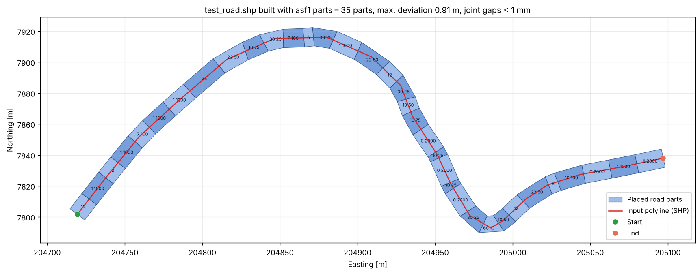
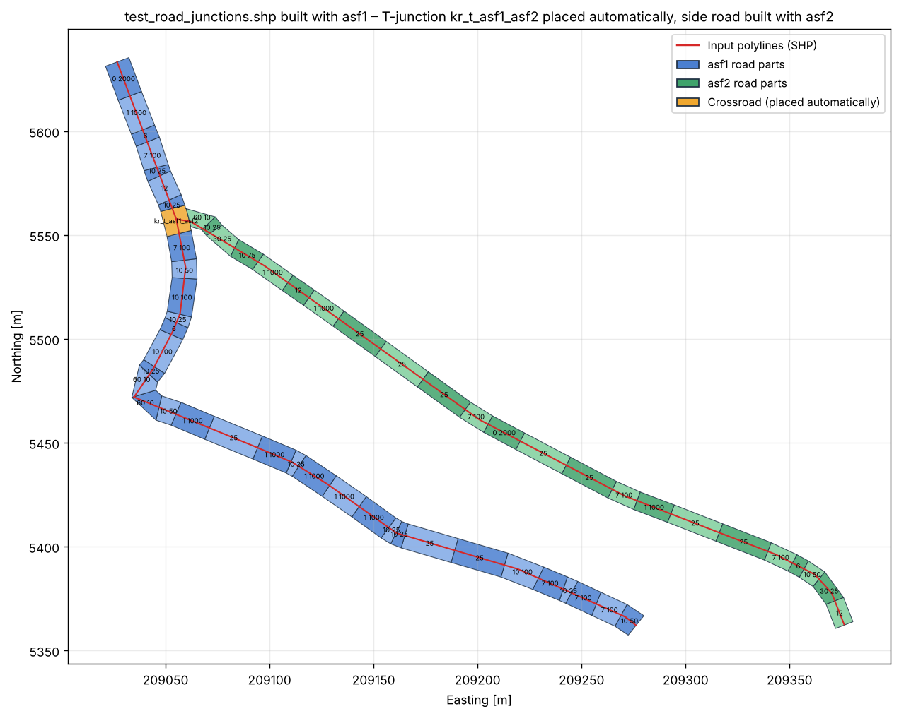

# DayZ Road Builder

**Automatically build DayZ roads from a polyline.**
DayZ Road Builder takes a road line (ESRI shapefile) and chains the original DayZ road parts
(`asf1_25`, `asf1_10 100`, `city_6`, `mud_60 10`, …) along it – seamlessly connected, exactly like the
road tool in Terrain Builder does, but without placing a single part by hand. The result is an object list
that you import straight into **Terrain Builder**. Where lines meet or cross, the matching **T-junction or
X-crossroad part is placed automatically** and the side roads are connected to it.



*The example above was reconstructed purely from the exported Terrain Builder file
([`example/test_road_asf1_objects.txt`](example/test_road_asf1_objects.txt)): red = input polyline,
blue = the 35 placed road parts. Max. deviation from the line 0.91 m (at the sharp 60° corner), average 0.20 m,
gaps between parts < 1 mm.*



*Road network from [`example/test_road_junctions.shp`](example/test_road_junctions.shp): three lines meet in the
north, so a `kr_t_asf1_asf2` T-junction is inserted into the asf1 through road and the side road starts exactly
at its side arm, built with the matching asf2 parts. In the south-west only two lines meet – that is simply a
corner of a continuous road.*

---

## Contents

- [Features](#features)
- [Repository layout](#repository-layout)
- [Requirements](#requirements)
- [Building in Visual Studio](#building-in-visual-studio)
- [Quick start](#quick-start)
- [Step-by-step usage](#step-by-step-usage)
- [Importing the result into Terrain Builder](#importing-the-result-into-terrain-builder)
- [Writing Road Tool roads into a project (.tv4p)](#writing-road-tool-roads-into-a-project-tv4p)
- [Export file format](#export-file-format)
- [Crossroads and road networks](#crossroads-and-road-networks)
- [How it works](#how-it-works)
- [Settings reference](#settings-reference)
- [Included road parts](#included-road-parts)
- [Command line version](#command-line-version)
- [Troubleshooting](#troubleshooting)
- [Limitations and ideas](#limitations-and-ideas)
- [Credits and license notes](#credits-and-license-notes)

---

## Features

- Reads the **original DayZ road part models** (unbinarized MLOD `.p3d`) and extracts the road memory points
  `LB`, `PB`, `LE`, `PE`. Length, curve angle, radius and width of every part are calculated automatically –
  no hard-coded part tables.
- Reads **polylines from shapefiles** (`PolyLine`, `PolyLineZ`, `PolyLineM`, `Polygon`). Several records or
  several lines per record become several roads.
- Automatically chooses the **best sequence of straights and curves** to follow the line (beam search),
  rounding off sharp corners with curve parts.
- Curves are also placed **reversed** to get the opposite turn direction (the same trick the Terrain Builder
  road tool uses).
- **No gaps:** every part starts exactly where the previous one ends.
- **Automatic crossroads:** lines that meet or cross are detected; T-junctions (`kr_t_*`) and X-crossroads
  (`kr_x_*`) are placed and the side roads start exactly at the crossroad's side arm – if the selected road type
  has crossroad parts.
- Lines that continue each other (end meets start) are joined into one continuous road.
- Optional **end pieces** (`*_6konec`) at the start and/or end of the road.
- You choose which parts may be used (for example, leave out the tight `60 10` curve on main roads).
- **Live preview** with zoom/pan. Hover over a part to see its name, position and yaw.
- **Export** to the Terrain Builder object import format (`.txt`), **or write the roads directly into your
  Terrain Builder project (`.tv4p`) as real Road Tool roads** that you can keep editing with the Road Tool.
- Settings are remembered between sessions.
- **Command line version** for batch processing.

## Repository layout

```
DayZRoadBuilder/
├─ DayZRoadBuilder.sln            ← open this in Visual Studio
├─ src/
│  ├─ DayZRoadBuilder.Core/       P3D reader, SHP reader, part library, road builder, TB exporter
│  ├─ DayZRoadBuilder.App/        Windows desktop app (WinForms) with preview – start project
│  └─ DayZRoadBuilder.Cli/        command line version
├─ RoadParts/                     DayZ road part models (.p3d), used to read the part geometry
│  ├─ Chernarus/                  asf1, asf2, asf3, city, grav, mud, crossroads
│  ├─ Livonia/                    asf1enoch, asf2enoch, mudenoch
│  ├─ Sakhal/                     asf1sakhal_*, asf2sakhal, asf3sakhal, gravsakhal, mudsakhal, quarrysakhal, snowroad
│  └─ Sidewalks/                  sidewalk models (binarized, not usable by the tool)
├─ example/
│  ├─ test_road.shp/.shx/.dbf/.prj             example polyline (single road)
│  ├─ test_road_asf1_objects.txt               result exported with the asf1 parts
│  ├─ test_road_junctions.shp/.shx/.dbf/.prj   example road network with a junction
│  └─ test_road_junctions_asf1_objects.txt     result exported with asf1 (+ asf2 side road)
└─ docs/images/                   images for this README
```

## Requirements

- **Windows 10/11**
- **Visual Studio Community 2022 or newer** with the **".NET desktop development"** workload
  (this includes the .NET 8 SDK). No NuGet packages or other dependencies are needed.
- To run a compiled build you need the **.NET 8 Desktop Runtime or newer**. The app is set to
  `RollForward=Major`, so it also runs on .NET 9 / 10.
- **DayZ Tools / Terrain Builder** for importing the result.

## Building in Visual Studio

1. Clone the repository, or download it as a ZIP and extract it.
2. Double-click **`DayZRoadBuilder.sln`**.
3. `DayZRoadBuilder.App` is the start project. Press **F5** (run) or use **Build → Build Solution**.
4. The EXE is created at
   `src\DayZRoadBuilder.App\bin\Debug\net8.0-windows\DayZRoadBuilder.exe`
   (or `bin\Release\…` if you build in Release configuration).

From a terminal you can also run `dotnet build -c Release` in the repository folder.

## Quick start

1. Start the app. It finds the bundled `RoadParts` folder automatically when the EXE sits anywhere inside
   the repository folder.
2. **Polyline (.shp)** → select `example/test_road.shp`.
3. **Road type** → `asf1`.
4. Click **Build road** and check the preview.
5. Click **Export for Terrain Builder (.txt)** and import the file into Terrain Builder
   ([see below](#importing-the-result-into-terrain-builder)).

## Step-by-step usage

### 1. Files

| Field | What to select |
|---|---|
| **Road parts folder** | A folder containing the road `.p3d` files. Subfolders are searched too. Use the bundled `RoadParts` folder, or your own `P:\DZ\structures\roads\parts`. The models must be **unbinarized (MLOD)**, as they are on the P: drive. Binarized (ODOL) files are skipped and listed in the log. |
| **Polyline (.shp)** | Your road line as a shapefile. Coordinates are used as they are, so the line must be in **Terrain Builder coordinates**. A shape exported from Terrain Builder already contains the 200000 easting offset. |

**Where does the polyline come from?** Draw the road as a line in a Terrain Builder shape layer and export it
as `.shp`, or draw it in QGIS / Global Mapper using the same coordinate system as your Terrain Builder project.
The line represents the **centre line** of the road. The direction you draw it in is the direction the parts are
chained in. You can flip it with *Reverse line direction*.

### 2. Road type and parts

- **Road type** lists every road family found in the folder: `asf1`, `asf2`, `asf3`, `city`, `grav`, `mud`,
  `asf1enoch`, `mudsakhal`, `snowroad`, …
- The checklist shows all straights and curves of that family with their geometry, for example
  `asf1_22 50 (Curve 22.5° R50 (19.63 m))`. **Untick parts you don't want to use.** For example, untick `60 10`
  on a main road if you don't want hairpin curves. Crosswalk parts are unticked by default.
- **End piece:** optionally place a `*_6konec` part at the start and/or end. If the end pieces face the wrong
  way, tick *flip end pieces*.

### 3. Crossroads

| Option | Meaning |
|---|---|
| **Place crossroads at junctions** | On: crossroad parts are placed where lines meet. Off: through roads are still built continuously, side roads simply start at the junction point. |
| **T-junction / X-crossroad** | Which crossroad part to use for the selected road type. *(automatic)* prefers a part with the same side road type (e.g. `kr_t_city_city`), otherwise the first available one (e.g. `kr_t_asf1_asf2`). Shows *(none for this road type)* if the type has no crossroad parts – then the roads are built without crossroads. |
| **Side roads use the crossroad's side road type** | Builds the side roads with the road type of the crossroad's side arm, so the widths match (e.g. `asf2` for `kr_t_asf1_asf2`). The ticked part sizes of the selected type are used for that type, too. |
| **Join distance [m]** | Line ends closer than this count as connected (default 1.5 m). |

See [Crossroads and road networks](#crossroads-and-road-networks) for how junctions are detected.

### 4. Fitting

The default values work well for most roads. See the [settings reference](#settings-reference) for details.

### 5. Build and check

Click **Build road**. The log shows each junction and one line per road, for example:

```
Junction T1 (3 lines) at 209055.1 / 5557.7: kr_t_asf1_asf2
Road 1 (asf1, 1 crossroad): 35 parts | line 440.0 m, road 434.5 m | max. deviation 3.00 m, avg 0.32 m | end gap 0.07 m | joints ≤ 0.000 m | 0.7 s
Road 2 (asf2, side road): 23 parts | line 376.9 m, road 378.2 m | max. deviation 4.01 m, avg 0.68 m | end gap 0.37 m | joints ≤ 0.000 m | 0.6 s
  Used: asf2_25 ×5, asf1_1 1000 ×5, asf1_10 25 ×4, …
```

- **max. deviation / avg** – how far the road centre line is from your polyline.
- **end gap** – distance between the end of the last part and the end of your line.
- **joints** – sanity check of the gaps between neighbouring parts (should always be ~0).

Preview controls: **mouse wheel** = zoom, **drag** with the left or middle mouse button = pan,
**double-click** = fit everything. Hover over a part to see its name, position and yaw in the status bar.
Reversed curves are marked with ↺. Crossroads are drawn orange, every road has its own colour, and junctions are
marked with a ring (gold = crossroad placed, red = no crossroad) and a label like `T1` / `X2`.

### 6. Export

There are two ways to get the result into Terrain Builder:

| Button | Result in Terrain Builder |
|---|---|
| **Export as objects (.txt) …** | Every road part becomes a normal object in an object layer ([import](#importing-the-result-into-terrain-builder)). |
| **Write as roads into Terrain Builder project (.tv4p) …** | The roads are added to a **copy** of your project as real **Road Tool roads**, including crossroads ([details](#writing-road-tool-roads-into-a-project-tv4p)). |

## Importing the result into Terrain Builder

### One-time preparation: the road parts must exist in your Terrain Builder library

Terrain Builder places objects by **template name**. Every name in the exported file (for example `asf1_25` or
`asf1_10 100`) must exist as a template in one of your Terrain Builder libraries. The template name is the
`.p3d` file name without the extension.

If your project already has the DayZ road parts in its library (for example, because you use the Terrain Builder
road tool), there is nothing to do. Otherwise:

1. Open the **Library Manager** in Terrain Builder.
2. Create a new library, for example `dz_roads`.
3. Add the road `.p3d` files from your **P: drive** (`P:\DZ\structures\roads\parts\…`) to that library.

> The `RoadParts` folder in this repository is only read by the tool to get the part geometry.
> Terrain Builder and the game always use the models from your P: drive / the game data.

### Import the object list

1. Open your Terrain Builder project. It must use the usual DayZ map frame origin: **Easting 200000, Northing 0**.
2. In the **Layers Manager**, go to **Objects** and add a new layer (for example `roads_generated`), or select an
   existing one. Make sure it is the **active** layer, because the objects are imported into it.
3. Choose **File → Import → Objects…**
4. Select the exported `.txt` file.
5. If the dialog shows height options (behind **Advanced**), choose **relative**. The file contains a height
   of `0` relative to the terrain.
6. Click **OK**. The parts appear along your line.

### Check the first import (important)

Two conventions are configurable because they cannot be verified without your Terrain Builder setup. Build a
short test road with at least one curve, import it and zoom in on the joints:

| What you see | Fix |
|---|---|
| Joints line up perfectly | Everything is correct. Keep the settings. |
| Curves bend the wrong way / the road is mirrored or rotated | Tick **Invert yaw (counter-clockwise)**. If it is rotated by a fixed angle, use **Yaw offset**. |
| Parts are shifted (curves ~1 m sideways, straights by half their length) | Set **Position =** to **Model origin [0,0,0]**. |
| Everything is shifted by exactly 200 km | The line has no Terrain Builder offset. Set **Offset X** to `200000` (or `-200000`). |
| "Wrong file format or source template not found" | A part name is not in your Terrain Builder library. See the preparation above. |

The app remembers these settings, so you only have to do this once.

## Writing Road Tool roads into a project (.tv4p)

Terrain Builder has no import for Road Tool roads. They only exist inside the binary project file (`.tv4p`). DayZ Road
Builder can therefore write the generated roads **directly into a copy of your project**. After opening it, the
roads are ordinary Road Tool roads: Terrain Builder shows them in the Road Tool, and you can edit, extend and delete
them there like hand-made roads.

**How to use it**

1. Your project's **Road Tool must already contain the road types** you build with. Every part used, including end
   pieces and crossroads, must be defined there. In the Road Tool, add the parts to a road type and the crossroads
   to the crossroad list, then save the project. Tip: [tv4p-road-tool](https://github.com/WoozyMasta/tv4p-road-tool)
   can generate these definitions from the `.p3d` files.
2. Build your roads in DayZ Road Builder as usual. Pick a **T-junction / X-crossroad part that is defined in your
   project**, for example `kr_t_asf1_asf3` instead of the automatic `kr_t_asf1_asf2`.
3. Click **Write as roads into Terrain Builder project (.tv4p) …**, choose your project, then choose a **new file name**
   (default `<project>_roads.tv4p`). The original project is never modified.
4. Close the project in Terrain Builder, then open the new file. Once you're happy with it, rename it or keep using it
   as your project. Keep the original as a backup.

The log lists the road types and crossroads found in your project. If a part is missing, nothing is written and the
log says which parts to add. The paths stored for the parts are taken from your project's Road Tool definitions.

**How the roads are stored.** A Road Tool road consists of one *key part* with a position and rotation, plus up to
four chains of parts:

```
                directiona (continues from the key's end edge LE/PE)
                      ↑
directionc  ←  [ key part ]  →  directiond      (side arms of a crossroad: LD/LH and PD/PH)
                      ↓
                directionb (continues from the key's start edge LB/PB)
```

DayZ Road Builder maps its result onto this structure:

- every placed **crossroad** becomes the key part of its own Road Tool road. The through road continues in
  `directiona`/`directionb`, and the side roads in `directionc`/`directiond`,
- every other road gets its first straight part as key part.

Curves that are driven in the opposite direction are stored as reversed curves (type 7), as the Road Tool does
itself.

> [!WARNING]
> The `.tv4p` format is not documented by Bohemia Interactive. The writer was built and checked against real
> projects. Each written file is read back, and the road geometry is rebuilt from it and compared with the object
> export, with an error below 1 mm. Still, **always keep a backup of your project** and check the result in Terrain
> Builder before you continue working on the new file.

## Export file format

One object per line, in the Terrain Builder object list format:

```
"asf1_12";204723.224;7806.642;37.7330;0.0000;0.0000;1.0000;0.000;
 name      X          Y        yaw     pitch  roll   scale  Z (relative to terrain)
```

| Field | Meaning |
|---|---|
| name | Template name, which is the `.p3d` file name without the extension |
| X / Y | Object position in Terrain Builder coordinates (easting / northing, metres). By default this is the **bounding box centre** of the model, which the engine uses as the object position for these parts (autocenter). |
| yaw | Rotation in degrees, **clockwise from north** (like `getDir`). |
| pitch / roll | Always `0`. Road parts follow the terrain in game. |
| scale | Always `1`. |
| Z | `0` = on the terrain surface. |

Decimal separator is always `.`, independent of your Windows language.

## Crossroads and road networks

All lines of the shapefile are treated as one **road network**:

1. **Connecting lines.** Line ends that are closer than the *join distance* are joined into one node. A line end
   lying on another line splits that line there (a T without a shared vertex), and two lines crossing each other are
   split at the crossing (an X without a shared vertex). Short overshoots (a line drawn a few metres across another
   line) are removed.
2. **What happens at a node** depends on how many lines meet there:

   | Lines | Result |
   |---|---|
   | 1 | Road end (an end piece can be placed here) |
   | 2 | The lines are joined into one continuous road (corners are rounded with curve parts) |
   | 3 | **T-junction** |
   | 4 | **X-crossroad** |
   | 5+ | Not supported – the roads just end at this point (warning in the log) |

3. **Through road and side roads.** At every junction the two arms that form the straightest line become the
   *through road* (arms of the same input line are preferred). At an X with two equally straight roads, the longer input line wins.
   The remaining arms are the *side roads*.
4. **Placing the crossroad.** The through road is built in one go. The crossroad part is inserted into its chain
   like a 12.5 m straight, centred on the junction point (it may shift up to 4 m along the road for a better fit). A
   T-junction is turned by 180° if the side road is on the right.
5. **Side roads** start **exactly** at the side arm of the placed crossroad, in the arm's direction, and then follow
   their line. A side road that ends at another crossroad arm is steered into that arm. Any small remaining gap is
   reported in the log.

**Crossroad parts and road types.** The crossroad name describes the road types it connects:
`kr_t_<through road>_<side road>`, `kr_x_<through road>_<side roads>` (for example `kr_t_asf1_asf2` = asf1 through
road with an asf2 side road). Only the Chernarus types have crossroad parts:

| Through road | T-junctions | X-crossroads |
|---|---|---|
| asf1 | `kr_t_asf1_asf2`, `kr_t_asf1_asf3`, `kr_t_asf1_city` | `kr_x_asf1_asf3`, `kr_x_asf1_city` |
| asf2 | `kr_t_asf2_asf2`, `kr_t_asf2_asf3` | `kr_x_asf2_asf3` |
| asf3 | `kr_t_asf3_asf3`, `kr_t_asf3_asf2`, `kr_t_asf3_mud` | – |
| city | `kr_t_city_city`, `kr_t_city_asf3` | `kr_x_city_city`, `kr_x_city_city_asf3` |
| mud | `kr_t_mud_mud` | – |

Road types without crossroad parts (Livonia, Sakhal, grav) are still built as a network. Through roads are
continuous and side roads start at the junction point, but no crossroad is placed.

**Tips for drawing networks**

- Draw main roads as **one continuous line** through the junctions and let side roads end on them – that gives
  the cleanest result.
- Leave at least **~20 m** between two junctions on the same road. A crossroad part is 12.5 m long, so
  junctions closer than that are shifted apart (warning in the log).
- Side roads leave a crossroad at 90°. If your line leaves at a sharper angle, the first parts of the side road
  will curve to reach the line.

## How it works

### 1. Reading the road parts

Each DayZ road part has a **memory LOD** with four named points:

```
      LE ─────────── PE        LE / PE = left / right point at the END
       │             │
       │   driving   │
       │  direction  │
       │      ↑      │
      LB ─────────── PB        LB / PB = left / right point at the BEGINNING
```

From these points the tool calculates:

- the centre of the start edge and the end edge,
- the driving direction at both ends (perpendicular to `LB→PB` and `LE→PE`),
- the **turn angle** (for example 22.5°), the **radius** (for example 50 m) and the centre line **length**,
- the **width** (asf1 = 12 m, asf2 = 9 m, asf3 = 7 m, city = 10 m, grav = 6 m, mud = 5 m, …),
- the bounding box centre over all LODs, which becomes the exported object position.

The part type is detected from the name: `…konec` = end piece, `…crosswalk` = crosswalk, `kr_…` = crossroad.
Everything else is a straight or a curve, depending on its geometry.

All DayZ curve parts turn **right**. A curve placed **reversed** (driven from its end to its start) turns
**left**. That way every curve is available in both directions.

### 2. Following the line (beam search)

The tool builds the road part by part from the start of the line:

1. A *state* is the open end of the chain built so far: a position and a driving direction.
2. From every state, **every allowed part** (curves in both directions) is appended in turn.
3. Each candidate gets a **cost**:
   - the **squared distance** between the part's centre line and the polyline, integrated along the part
     (sampled every ~1 m),
   - the squared **heading error** at the end of the part,
   - a small **penalty per part**, which prefers longer parts,
   - a small **penalty per degree of curve**, which avoids needless left-right wiggling,
   - at the end of the line, the squared distance to the line's end point.
4. Candidates are sorted by how far along the line they got (their **chainage**, in 0.5 m bins). In every bin,
   only the best *N* candidates survive (*Search width*). Near-duplicates are removed so the kept candidates
   stay diverse.
5. When a candidate reaches the end of the line within the *End tolerance*, it becomes a finished road. The
   cheapest finished road wins.

Because each part is placed exactly at the exit of the previous one, using the real memory points, the
result has **no gaps**. Sharp corners in the polyline cannot be driven exactly with real parts, so the search
automatically rounds them off with the tightest suitable curves.

The projection onto the line is always done in a **local window** around the current chainage. Lines that
cross themselves, hairpins and closed loops therefore work too.

### 3. Exporting

For every placed part, the tool writes the template name, the world position of the model's reference point
(bounding box centre) and the yaw.

## Settings reference

| Setting | Default | Effect |
|---|---|---|
| **Search width** | 12 | Candidates kept per 0.5 m of line. Higher = more accurate but slower. 8–30 is sensible. Above ~12 the result rarely changes. |
| **Penalty per part** | 1.0 | Higher = fewer and longer parts, slightly more deviation. |
| **Penalty per degree** | 0.05 | Higher = more straights and fewer small corrective curves. |
| **End tolerance [m]** | 3.5 | How far from the end of the line the last part may stop. Increase it if the log says the end was not reached. |
| **Start angle ± [°]** | 0 | Also tries start directions within ± this angle of the first line segment. Useful if the line starts with a short kink. |
| **Reverse line direction** | off | Builds from the other end of the line. |
| **End piece / at start / at end / flip** | none | Optional end pieces and their orientation. |
| **Position =** | bounding box centre | Which model point is exported as the object position. |
| **Invert yaw** | off | Flips the rotation direction (see [troubleshooting](#troubleshooting)). |
| **Yaw offset [°]** | 0 | Added to every yaw. |
| **Offset X / Y [m]** | 0 | Added to all exported coordinates. |
| **Place crossroads at junctions** | on | See [crossroads](#crossroads-and-road-networks). |
| **T-junction / X-crossroad** | automatic | Crossroad part for the selected road type. |
| **Side roads use the crossroad's side road type** | on | Side roads get the road type of the crossroad's side arm. |
| **Join distance [m]** | 1.5 | Line ends closer than this count as connected. |

Settings are stored in `%AppData%\DayZRoadBuilder\settings.ini`.

## Included road parts

All families share the same part set:

| Part suffix | Type | Geometry |
|---|---|---|
| `_25`, `_12`, `_6` | straight | 25 m, 12.5 m, 6.25 m |
| `_0 2000` | curve | 0.5°, radius 2000 m, 17.45 m |
| `_1 1000` | curve | 1°, radius 1000 m, 17.45 m |
| `_7 100` | curve | 7.5°, radius 100 m, 13.09 m |
| `_10 100` / `_10 75` / `_10 50` / `_10 25` | curve | 10°, radius 100 / 75 / 50 / 25 m |
| `_15 75` | curve | 15°, radius 75 m, 19.63 m |
| `_22 50` | curve | 22.5°, radius 50 m, 19.63 m |
| `_30 25` | curve | 30°, radius 25 m, 13.09 m |
| `_60 10` | curve | 60°, radius 10 m, 10.47 m |
| `_6konec` | end piece | 6.25 m |
| `_6_crosswalk` | crosswalk | 6.25 m (asf1, asf2, city) |

| Folder | Families (width) |
|---|---|
| Chernarus | `asf1` (12 m), `asf2` (9 m), `asf3` (7 m), `city` (10 m), `grav` (6 m), `mud` (5 m), crossroads `kr_t_*`, `kr_x_*` |
| Livonia | `asf1enoch` (12 m), `asf2enoch` (9 m), `mudenoch` (5 m) |
| Sakhal | `asf1sakhal_dashedline` (12 m), `asf1sakhal_fullLine` (12 m), `asf2sakhal` (9 m), `asf3sakhal` (7 m), `gravsakhal` (6 m), `mudsakhal` (6 m), `quarrysakhal` (12 m), `snowroad` (6 m) |
| Sidewalks | binarized, so the tool cannot read them |

To list everything the tool finds in a folder:
`DayZRoadBuilder.Cli --parts RoadParts --list`

## Command line version

```
DayZRoadBuilder.Cli --parts <folder> --shp <file.shp> --family <type> --out <file.txt> [options]
```

| Option | Meaning |
|---|---|
| `--parts <folder>` | Folder with the road P3Ds (searched recursively) |
| `--shp <file.shp>` | Polyline shapefile |
| `--family <type>` | Road type, for example `asf1`, `city`, `mud`, `asf1enoch` |
| `--out <file.txt>` | Terrain Builder object list to write |
| `--list` | Only list the road types and parts found |
| `--exclude <a,b,…>` | Exclude parts by name, for example `--exclude "asf1_60 10,asf1_30 25"` |
| `--endcap <name>` | End piece at start and end, for example `--endcap asf1_6konec` |
| `--flip-endcaps` | Place the end pieces reversed |
| `--reverse` | Reverse the line direction |
| `--beam <n>` | Search width (default 12) |
| `--piece-penalty <x>` | Penalty per part (default 1.0) |
| `--turn-penalty <x>` | Penalty per degree of curve (default 0.05) |
| `--end-tol <m>` | End tolerance (default 3.5) |
| `--model-origin` | Export the model origin instead of the bounding box centre |
| `--invert-yaw` | Invert the yaw sign |
| `--yaw-offset <deg>` | Yaw offset |
| `--offset-x <m>`, `--offset-y <m>` | Coordinate offset |
| `--no-crossroads` | Don't place crossroad parts |
| `--t-part <name>` / `--x-part <name>` | Crossroad part to use, for example `--t-part kr_t_asf1_city` (default: automatic) |
| `--same-type-side-roads` | Build side roads with the selected road type instead of the crossroad's side road type |
| `--snap <m>` | Join distance for line ends (default 1.5) |
| `--tv4p <project.tv4p> --tv4p-out <new.tv4p>` | Also write the roads as Road Tool roads into a copy of the project |
| `--tv4p-info <project.tv4p>` | Show the Road Tool road types and crossroads defined in a project |

Example:

```
DayZRoadBuilder.Cli --parts RoadParts --shp example\test_road_junctions.shp --family asf1 --out road.txt
Junction 1 (T, 3 lines) at (209055.141; 5557.730): kr_t_asf1_asf2 placed
Road 1 (asf1, 1 crossroad): line 440.0 m -> 35 parts, road 434.5 m, max. deviation 3.00 m, RMS 0.32 m, end gap 0.07 m, max. joint gap 0.0000 m
Road 2 (asf2, side road): line 376.9 m -> 23 parts, road 378.2 m, max. deviation 4.01 m, RMS 0.68 m, end gap 0.37 m, max. joint gap 0.0000 m
58 objects written: road.txt
```

## Troubleshooting

| Problem | Solution |
|---|---|
| "binarized (ODOL) P3D file(s) skipped" | The tool can only read unbinarized models. Use the models from the P: drive (DayZ Tools → extracted game data) or the bundled `RoadParts` folder. |
| "The end of the line was not reached within the tolerance" | Enable more or shorter parts (`_6`, `_10 25`), increase *End tolerance*, or check that the line has no extremely sharp zig-zags. |
| "No T crossroad part for road type …" | The selected road type has no crossroad parts (only Chernarus types have them). Choose another type or place the crossroad by hand. |
| A junction is not detected | The line ends are further apart than the *join distance*. Increase it, or snap the lines together in your GIS / Terrain Builder. |
| The wrong road is treated as the through road | Draw the through road as one continuous line across the junction, so it is preferred. |
| The road cuts a sharp corner of the line | Sharp corners can't be driven with real parts. Enable tighter curves (`30 25`, `60 10`) or draw the corner as a smooth arc. |
| Many small curves on a straight section | Increase *Penalty per degree* (for example `0.2`). |
| Too many short parts | Increase *Penalty per part* (for example `3`). |
| Parts are mirrored, rotated or shifted after import | See [Check the first import](#check-the-first-import-important). |
| A closed loop has a small gap or overlap where it meets itself | Expected. Parts have fixed lengths, so the loop rarely closes exactly. Fix the last part by hand. |

## Limitations and ideas

- Crossroads need the road type to have `kr_t_*` / `kr_x_*` parts (Chernarus types only). Junctions where 5 or
  more lines meet, and a line crossing **itself**, are not turned into crossroads.
- A side road that has to end at a *second* crossroad arm usually meets it with a small gap (shown in the log).
  Parts have fixed lengths, so the road rarely fits exactly between two fixed points.
- Crossroad parts that also change the through road type (`kr_x_city_city_asf3`) are only used if you select
  them. The through road keeps its type after the crossroad.
- Pitch, roll and height are always 0. The road parts follow the terrain in game.
- Binarized (ODOL) models cannot be read.
- Ideas: mixed road types per shapefile attribute, sidewalks along roads.

## Credits and license notes

- The `.tv4p` road format was worked out from real project files. Thanks to
  [tv4p-road-tool](https://github.com/WoozyMasta/tv4p-road-tool) and
  [DayZ Road Studio](https://github.com/MrKamil404/dayz-road-studio) for showing that Road Tool data can be edited
  outside Terrain Builder. No code from these projects is used.
- The road part models in `RoadParts/` are **© Bohemia Interactive** and come from DayZ / DayZ Tools. They are
  included only so the tool works out of the box, and remain subject to Bohemia Interactive's DayZ licence and
  modding terms. They are not covered by this project's licence.
- Shapefile format: ESRI Shapefile Technical Description. P3D MLOD format: Bohemia Interactive (Object Builder).
